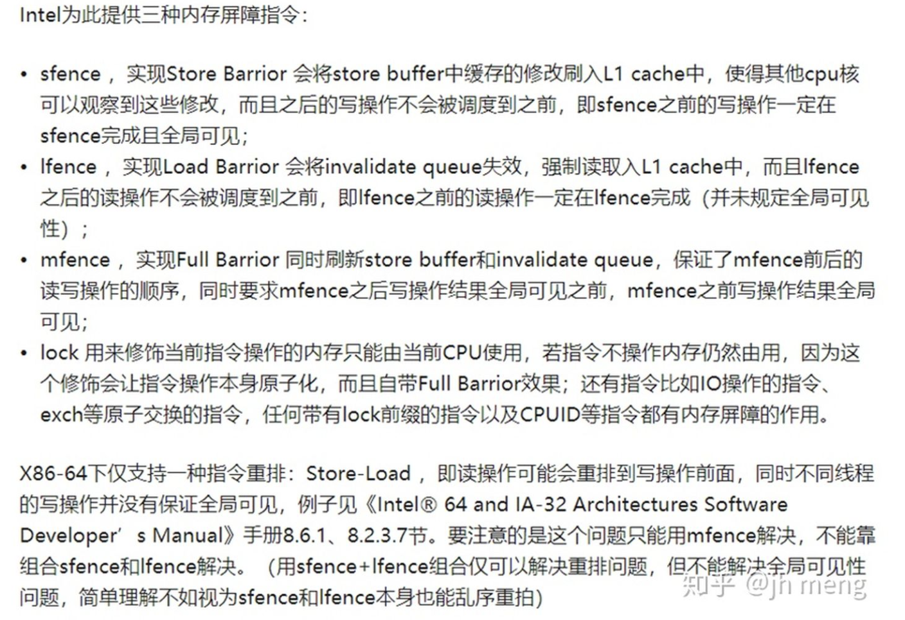

# 好文章

https://www.kernel.org/doc/html/latest/core-api/wrappers/memory-barriers.html # 内核官文
https://www.cnblogs.com/fanguang/p/16643434.html # 上文的中文翻译，上文英文太长了
https://blog.csdn.net/weixin_45030965/article/details/132852641 # 网友好文
https://cloud.tencent.com/developer/article/1801450 # 网友好文
https://www.kernel.org/doc/html/latest/process/volatile-considered-harmful.html # linux不赞成使用volatile关键字
https://lwn.net/Articles/233482/ # 上文的引用文，linus大神讲述为啥不用volatile
https://cloud.tencent.com/developer/article/1801450 # 讲到观察编译器乱序


# 概述

一共有两层乱序：编译器乱序和CPU乱序

和一个问题：变量发布，即一个CPU修改来某个变量，要让其他CPU知晓

# 编译器乱序

编译器乱序和变量发布是通过barrier()搞定。
来源于：https://blog.csdn.net/linuxweiyh/article/details/79139766

barrier()语句的意思是：下面的语句不能跑上面去，上面的语句也不能跑下面来。

READ_ONCE() 和 WRITE_ONCE()也可以用来预防编译器乱序，但是它只防止所有READ_ONCE()/WRITE_ONCE()之前的顺序被搞乱，其他变量它就不管了，效果没有barrier()好。

对应的汇编是`__volatile__("": : :"memory")`

根据《深入理解linux内核》：

其中volatile关键字搞定编译器乱序，memory指令让编译器不要使用CPU寄存器

memory很可能是伪代码，因为它仅仅是给编译器优化的提示，和CPU无关，所以称为优化屏障更为贴切，它不是内存屏障


## 相关代码

```c
// compiler.h:
/* The "volatile" is due to gcc bugs */
# define barrier() __asm__ __volatile__("": : :"memory")

#define READ_ONCE(x) (*(volatile typeof(x) *)&(x))

#define WRITE_ONCE(x, val) \
({							\
	union { typeof(x) __val; char __c[1]; } __u =	\
		{ .__val = (__force typeof(x)) (val) }; \
	__write_once_size(&(x), __u.__c, sizeof(x));	\
	__u.__val;					\
})

```

# CPU乱序和变量发布

要通过smp_wmb() smp_rmb() smp_mb()来解决，下面简写去掉smp前缀

用了上面的宏，是同时搞定CPU乱序和变量发布两个事情的！

smb() ：防止store-store乱序，在x86上优化成barrier()，因为此情况不会在x86上发生，对应的指令是sfence

rmb()：防止load-load乱序，在x86上可能是lfence或者`volatile("lock;addl $0, 0(%%esp)":::"memory")`

mb()：防止store-load和load-store乱序，对应的指令是mfence

其中intel只有store-load乱序，没有其他乱序情况，所以intel平台只会用到mb()（即mfence）

intel还提供lock前缀的指令，效果等同于mfence，但根据glibc代码注释，mfence比lock前缀指令慢上很多，所以优选lock前缀指令

但据intel论坛的讨论，两种指令的耗时都是100个指令周期，并无差别



## 相关代码

```c
define mb() 	asm volatile("mfence":::"memory")
define rmb()	asm volatile("lfence":::"memory")
define wmb()	asm volatile("sfence" ::: "memory")
```


# C语言中的原子操作


根据：~/MyEBook/glibc2.39/glibc-2.39/sysdeps/x86/atomic-machine.h

```c
/* We don't use mfence because it is supposedly slower due to having to
   provide stronger guarantees (e.g., regarding self-modifying code).  */
#define atomic_full_barrier() \
    __asm __volatile (LOCK_PREFIX "orl $0, (%%" SP_REG ")" ::: "memory")
#define atomic_read_barrier() __asm ("" ::: "memory")
#define atomic_write_barrier() __asm ("" ::: "memory")

```


include/atomic.h代码：

```c
// atomic_load_relaxed的实现:
# ifndef atomic_load_relaxed
#  define atomic_load_relaxed(mem) \
   ({ __typeof ((__typeof (*(mem))) *(mem)) __atg100_val;		      \
   __asm ("" : "=r" (__atg100_val) : "0" (*(mem)));			      \
   __atg100_val; })
# endif

// atomic_load_acquire的实现:就是简单读取，然后跟一个内存屏障，acquire()屏障就是rmb()，在intel平台只起编译器屏障的作用
# ifndef atomic_load_acquire
#  define atomic_load_acquire(mem) \
   ({ __typeof (*(mem)) __atg101_val = atomic_load_relaxed (mem);	      \
   atomic_thread_fence_acquire ();					      \
   __atg101_val; })
# endif

// atomic_store_release的实现：就是先跟一个内存屏障，然后简单赋值，release()屏障就是wmb()，在intel平台只起编译器屏障的作用
# ifndef atomic_store_release
#  define atomic_store_release(mem, val) \
   do {									      \
     atomic_thread_fence_release ();					      \
     atomic_store_relaxed ((mem), (val));				      \
   } while (0)
# endif

# define atomic_store_relaxed(mem, val) \
  do {									      \
    __atomic_check_size_ls((mem));					      \
    __atomic_store_n ((mem), (val), __ATOMIC_RELAXED);			      \
  } while (0)
# define atomic_store_release(mem, val) \
  do {									      \
    __atomic_check_size_ls((mem));					      \
    __atomic_store_n ((mem), (val), __ATOMIC_RELEASE);			      \
  } while (0)


// 各种屏障的实现
# ifndef atomic_thread_fence_acquire
#  define atomic_thread_fence_acquire() atomic_read_barrier ()
# endif
# ifndef atomic_thread_fence_release
#  define atomic_thread_fence_release() atomic_write_barrier ()
# endif
# ifndef atomic_thread_fence_seq_cst
#  define atomic_thread_fence_seq_cst() atomic_full_barrier ()
# endif


// x86_64平台的实现：
# define atomic_store_relaxed(mem, val) \
  do {									      \
    __atomic_check_size_ls((mem));					      \
    __atomic_store_n ((mem), (val), __ATOMIC_RELAXED);			      \
  } while (0)
# define atomic_store_release(mem, val) \
  do {									      \
    __atomic_check_size_ls((mem));					      \
    __atomic_store_n ((mem), (val), __ATOMIC_RELEASE);			      \
  } while (0)

```

以上是通用实现，其实真正在x86_64编译的时候不使用这个实现，而是使用gcc的build-in实现，所以实现代码也不在glibc里面

```c
#include <stdatomic.h>

int main(void) {
    _Atomic long counter = 0;

    atomic_store_explicit(&counter, 8, memory_order_release);
    atomic_load_explicit(&counter, memory_order_acquire);
}

```

查看它的预处理，是这样的：

```c
# 3 "atomic.c"
int main(void) {
    _Atomic long counter = 0;


# 6 "atomic.c" 3 4
   __extension__ ({ __auto_type __atomic_store_ptr = (
# 6 "atomic.c"
   &counter
# 6 "atomic.c" 3 4
   ); __typeof__ ((void)0, *__atomic_store_ptr) __atomic_store_tmp = (
# 6 "atomic.c"
   8
# 6 "atomic.c" 3 4
   ); __atomic_store (__atomic_store_ptr, &__atomic_store_tmp, (
# 6 "atomic.c"
   memory_order_release
# 6 "atomic.c" 3 4
   )); })
# 6 "atomic.c"
                                                           ;

# 7 "atomic.c" 3 4
   __extension__ ({ __auto_type __atomic_load_ptr = (
# 7 "atomic.c"
   &counter
# 7 "atomic.c" 3 4
   ); __typeof__ ((void)0, *__atomic_load_ptr) __atomic_load_tmp; __atomic_load (__atomic_load_ptr, &__atomic_load_tmp, (
# 7 "atomic.c"
   memory_order_acquire
# 7 "atomic.c" 3 4
   )); __atomic_load_tmp; })
# 7 "atomic.c"
```

可以看到都是调用__atomic_load()函数，这个函数在gcc手册Built-in Functions for Memory Model Aware Atomic Operations章节

下面是gcc13的实现，__atomic_store居然是memcpy()

```c
void __atomic_store (size_t size, void *obj, void *val, int model)
{
  memcpy (obj, val, size); // 辛辛苦苦追寻的model参数被无情的抛弃
}

```


## 好文章

https://www.cnblogs.com/sunddenly/articles/15389917.html # 网友文章
https://blog.csdn.net/bill_xiang/article/details/51286854 # 网友文章
https://blog.csdn.net/zhangxiao93/article/details/42966279 # 网友文章
https://runebook.dev/zh/docs/gcc/extended-asm # gcc手册中文版

## 读->读不允许乱序、写->写不允许乱序


## 读->写不允许乱序


## 写->读 如果位置相同不允许乱序，如果位置不同允许乱序


## 所有写入都是全局可见


## 总结

只有写->读一种情况可能乱序

# gcc手册提到

6.46 章节有说

# golang 原子性

## 好文章

https://blog.csdn.net/qq_43598865/article/details/124477353 # 网友写得很好

## 概述

go的atomic包的函数是不指定内存顺序的，所以它的使用办法是最简单：

只需保证所有携程间共享变量都通过atomic.StoreXXX()和atomic.LoadXXX()来操作，必定没有乱序问题，推测它使用了最严格的顺序一致性


